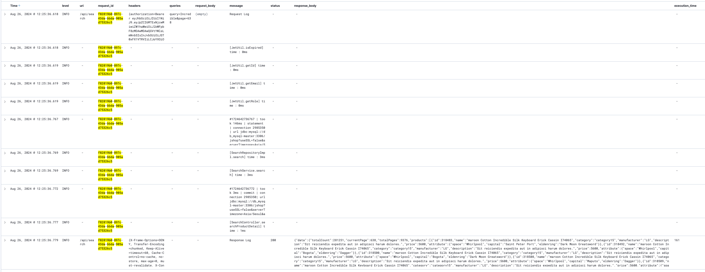

# JSHOP

## 프로젝트 목표

* 이커머스 플랫폼을 설계해보고 직접 구현합니다.
* 테스트 데이터를 넣어 성능 테스트를 진행하고 결과를 분석해 최적화 합니다.
* https://github.com/f-lab-edu/jshop/wiki/성능-테스트

## 프로젝트 이슈사항

1. 검색 성능 최적화 과정 (`0.5 RPS` -> `45 RPS`, `4000ms` -> `200ms`)    
   https://velog.io/@jhkim31/series/검색-성능-최적화

2. 로그인 성능 최적화 과정 (`60RPS` -> `450 RPS`)    
   https://velog.io/@jhkim31/로그인-성능-최적화

3. 자원 인가로직 **AoP**를 사용해 분리    
   https://velog.io/@jhkim31/리팩토링-1.-중복-인가로직-제거    
   https://velog.io/@jhkim31/리팩토링-2.-서비스-레이어-PreAuthorize-사용

4. 테스트에서 `@Transactional` 사용에 관한 문제    
   https://velog.io/@jhkim31/테스트와-Transactional

5. **KVM**, **Docker Swarm** 테스트 인프라 구축    
   https://velog.io/@jhkim31/series/테스트-인프라-구축

6. 데이터 베이스 재고 **동시성 문제** 해결   
   https://velog.io/@jhkim31/데이터베이스-동시성-문제

7. `@Transcational`과 분산락 사용시 고려해야 할 점    
   https://velog.io/@jhkim31/트러블슈팅-분산락과-Transactional

8. 테스트 의존 해결을 위한 **테스트 컨테이너** 도입   
   https://velog.io/@jhkim31/Spring-테스트-컨테이너

9. `WebMvcTest` 슬라이스 테스트에서 `SecurityContext` 설정     
   https://velog.io/@jhkim31/Controller-단위-테스트에서-SecurityContext를-설정해보자

10. 테스트 데이터 삽입 최적화  
    https://velog.io/@jhkim31/테스트-데이터-삽입-최적화

11. **스프링 MVC** 로깅하기   
    https://velog.io/@jhkim31/스프링-MVC-로깅하기

## 프로젝트 중점사항

* **객체지향 설계**를 통해 재사용성과 유지보수성을 높임
* 비즈니스로직을 최대한 엔티티에 작성해 재사용성과 테스트 용이성을 높임

* **git-flow** 정책과 `rebase, cherry-pick` 등 명령으로 브랜치를 용도별로 깔끔하게 관리
* Github의 **Wiki**, **Projects** 기능을 활용해 프로젝트 관리
* 원활한 협업(**PR**, **코드리뷰**)를 위한 커밋 작성

* **자원에 대한 인가**, **분산락**등 수평 관심사를 **AoP**로 분리
* **스프링 시큐리티**를 사용해 JWT 인증, 인가를 구현
* 시큐리티 프록시 필터 앞에 로깅 필터를 넣어 **모든 요청 로그를 기록**
* 테스트 환경에서 시큐리티 컨텍스트를 제공
* 개발과 배포 환경을 **프로파일로 분리**하여 각 환경에 맞는 배포 파이프라인을 구축
* **멀티모듈** 구조를 적용해 스프링 컨텍스트에 대한 학습과 모듈 단위로 코드의 재사용성을 높임

* **JPA**를 사용해 데이터 접근을 추상화
* **엔티티**를 직접 설계해보며 성능과 관련된 문제들을 해결
* **QueryDSL**을 사용해 검색 동적 쿼리 해결
* **Cursor**, **Offset** 을 사용한 페이징 구현

* 단위 테스트를 각 계층별로 **슬라이스 테스트**로 작성해 빠르고 반복적인 테스트 수행
* 통합 테스트시 외부 의존을 해결하기 위해 모든 테스트에서 하나의 **테스트 컨테이너**를 싱글톤으로 사용
* 성능 테스트를 위한 인프라와 모니터링 환경을 구축
* 성능 테스트를 통해 시스템의 병목지점을 파악해 해결
* MySQL **실행계획분석**과 **인덱스**를 통해 쿼리를 최적화

* **KVM** 과 **Docker Swarm** 을 사용해 인프라 구축 (3 마스터, 2 워커)
* 특정 Github 이벤트 발생시 웹훅으로 **Jenkins**를 통해 서버에 배포까지 이어지는 파이프라인을 구축
* **Prometheus**로 데이터를 수집하고, **Grafana**로 시각화
* **ELK** 스택을 구축해 수평확장이 되는 환경에서도 로그를 쉽게 수집, 확인

## API

### User

| METHOD  | URI                  | 설명                                       |
|:--------|:---------------------|:-----------------------------------------|
| `POST`  | `/api/login`         | 로그인 (Spring Security)                    |
| `POST`  | `/api/logout`        | 로그아웃 (Spring Security)                   |
| `POST`  | `/api/join`          | 회원가입                                     |
| `GET`   | `/api/users`         | 회원 정보 가져오기, JWT로 회원 구분 (기본정보, 잔액, 주소정보등) |
| `PATCH` | `/api/users`         | 회원 정보 수정                                 |
| `PATCH` | `/api/users/balance` | 회원 잔액 수정                                 |
| `PATCH` | `/api/users/balance` | 회원 잔액 수정                                 |

### Address

| METHOD   | URI                   | 설명                  |
|:---------|:----------------------|:--------------------|
| `POST`   | `/api/addresses`      | 현재 로그인한 회원으로 주소 생성  |
| `DELETE` | `/api/addresses/{id}` | 회원이 주소의 소유자라면 주소 삭제 |
| `PUT`    | `/api/addresses/{id}` | 회원이 주소의 소유자라면 주소 수정 |

### Cart

| METHOD   | URI                                      | 설명                          |
|:---------|:-----------------------------------------|:----------------------------|
| `POST`   | `/api/cart`                              | 현재 로그인한 회원의 장바구니에 상품 추가     |
| `GET`    | `/api/cart?page={page:0}&size={size:30}` | 현재 로그인한 회원의 장바구니 가져오기       |
| `PUT`    | `/api/cart/{cart_product_detail_id}`     | 현재 로그인한 회원의 장바구니 상품 수정 (수량) |
| `DELETE` | `/api/cart/{cart_product_detail_id}`     | 현재 로그인한 회원의 장바구니 상품 삭제      |

### Category

| METHOD | URI               | 설명                 |
|:-------|:------------------|:-------------------|
| `POST` | `/api/categories` | 카테고리 생성 (ADMIN 전용) |
| `GET`  | `/api/categories` | 카테고리 정보 가져오기       |

### Coupon

| METHOD | URI                       | 설명               |
|:-------|:--------------------------|:-----------------|
| `POST` | `/api/coupon`             | 쿠폰 생성 (ADMIN 전용) |
| `POST` | `/api/coupon/{coupon_id}` | 쿠폰 발급 요청 (일반 회원) |

### Search

| METHOD | URI                                                                | 설명                                   |
|:-------|:-------------------------------------------------------------------|:-------------------------------------|
| `GET`  | `/api/search?query={query}`                                        | 상품 검색 (query)                        |
| `GET`  | `/api/search?manufacturer={manufacturer}`                          | 상품 검색 필터링 (제조사)                      |
| `GET`  | `/api/search?categoryId={category_id}`                             | 상품 검색 필터링 (카테고리)                     |
| `GET`  | `/api/search?attributeFilters[0][attr_key]=attr_value`             | 상품 검색 필터링 (상품 속성, ex {color : red} ) |
| `GET`  | `/api/search?page={page:0}&size={size:30}&sort={key,(desc / asc)}` | 상품 검색 페이징 및 정렬                       |

### Product

| METHOD   | URI                                                     | 설명                      |
|:---------|:--------------------------------------------------------|:------------------------|
| `POST`   | `/api/products`                                         | 현재 로그인한 회원이 판매자라면 상품 생성 |
| `GET`    | `/api/products?page={page:0}&size={size:30}`            | 현재 로그인한 회원의 상품 정보 제공    |
| `POST`   | `/api/products/{product_id}/details`                    | 상품의 상세 상품 생성            |
| `PUT`    | `/api/products/{product_id}/details/{detail_id}`        | 상품의 상세 상품 수정            |
| `DELETE` | `/api/products/{product_id}/details/{detail_id}`        | 상품의 상세 상품 삭제            |
| `PATCH`  | `/api/products/{product_id}/details/{detail_id}/stocks` | 상품의 상세 상품 재고 수정         |

### Order

| METHOD   | URI                                                          | 설명                              |
|:---------|:-------------------------------------------------------------|:--------------------------------|
| `POST`   | `/api/orders`                                                | 주문 생성                           |
| `GET`    | `/api/orders?last_timestamp={last_timestamp}&size={size:10}` | 자신의 주문 정보 제공 (주문 시점을 키로 커서 페이징) |
| `GET`    | `/api/orders/{order_id}`                                     | (주문의 소유주라면) 주문 가져오기             |
| `DELETE` | `/api/orders/{order_id}`                                     | (주문의 소유주라면) 주문 삭제하기             |

## 스크린샷

### ERD

### USECASE

### 모니터링

### 로깅

### 성능 테스트 ( 최적화전 | + SQL 최적화 | + Redis 캐싱 )

   
   
   
   

