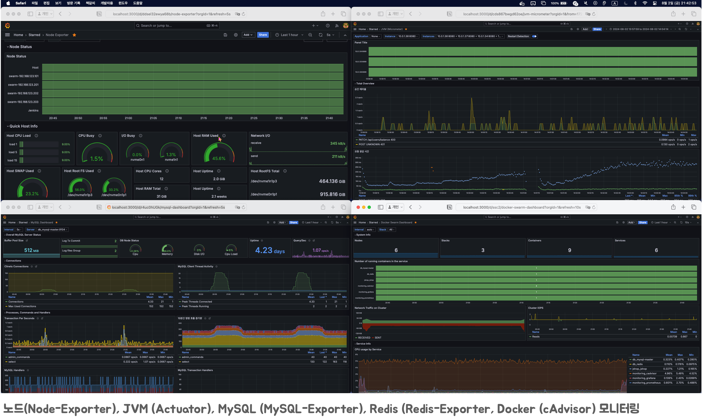

# JSHOP

## 프로젝트 목표
* 이커머스 플랫폼을 설계해보고 직접 구현합니다.
* 테스트 데이터를 넣어 성능 테스트를 진행하고 결과를 분석해 최적화 합니다.

## 프로젝트 중점사항
* **객체지향 설계**를 통해 재사용성과 유지보수성을 높임
* **git-flow** 정책과 `rebase, cherry-pick` 등으로 브랜치를 용도별로 깔끔하게 관리 
* **ERD**와 **엔티티**를 직접 설계해보며 성능 문제를 해결
* **JPA**를 사용해 데이터 접근을 추상화
* 인가, 분산락등 수평 관심사를 **AoP**로 분리
* 데이터베이스 **동시성 문제**를 목적에 따라 **비관적 락**, **낙관적 락**, **분산 락** 으로 해결
* 시큐리티 프록시 필터 앞에 로깅 필터를 넣어 모든 로그를 기록
* 개발과 배포 환경을 **프로파일로 분리**하여 각 환경에 맞는 배포 파이프라인을 구축
* **멀티모듈** 구조를 적용해 모듈 단위로 코드의 재사용성을 높임
* 단위 테스트를 **슬라이스 테스트**로 작성해 빠르고 반복적인 테스트 수행
* 성능 테스트를 위한 인프라와 모니터링 환경을 구축
* 성능 테스트를 통해 시스템의 병목지점을 파악해 해결
* MySQL **실행계획분석**과 **인덱스**를 통해 쿼리를 최적화
* **ELK** 스택을 구축해 수평확장이 되는 환경에서도 로그를 쉽게 확인
* **스프링 시큐리티**를 사용해 JWT 인증, 인가를 구현
* 테스트 환경에서 시큐리티 컨텍스트를 제공
* **Prometheus**로 데이터를 수집하고, **Grafana**로 시각화
* Github 이벤트가 발생시 **Jenkins**를 통해 서버에 배포까지 이어지는 파이프라인을 구축
* 테스트시 `@Transactional` 이 주는 영향과, 이를 사용하지 않는 테스트를 작성
* **nGrinder** 를 사용해 부하 테스트를 진행

## 프로젝트 이슈사항
1. `WebMvcTest` 슬라이스 테스트에서 `SecurityContext` 설정     
   https://velog.io/@jhkim31/Controller-단위-테스트에서-SecurityContext를-설정해보자
2. **스프링 MVC** 로깅하기   
   https://velog.io/@jhkim31/스프링-MVC-로깅하기
3. 자원 인가로직 **AoP**를 사용해 분리    
   https://velog.io/@jhkim31/리팩토링-1.-중복-인가로직-제거    
   https://velog.io/@jhkim31/리팩토링-2.-서비스-레이어-PreAuthorize-사용  
4. 테스트에서 `@Transactional` 사용에 관한 문제    
   https://velog.io/@jhkim31/테스트와-Transactional
5. **KVM**, **Docker Swarm** 인프라 구축    
   https://velog.io/@jhkim31/series/테스트-인프라-구축
6. 데이터 베이스 재고 **동시성 문제** 해결   
   https://velog.io/@jhkim31/데이터베이스-동시성-문제
7. `@Transcational`과 분산락 사용시 고려해야 할 점    
   https://velog.io/@jhkim31/트러블슈팅-분산락과-Transactional
8. 테스트 의존 해결을 위한 **테스트 컨테이너** 도입   
   https://velog.io/@jhkim31/Spring-테스트-컨테이너
9. 검색 성능 최적화 과정   
   https://velog.io/@jhkim31/series/검색-성능-최적화

### ERD

### 모니터링

