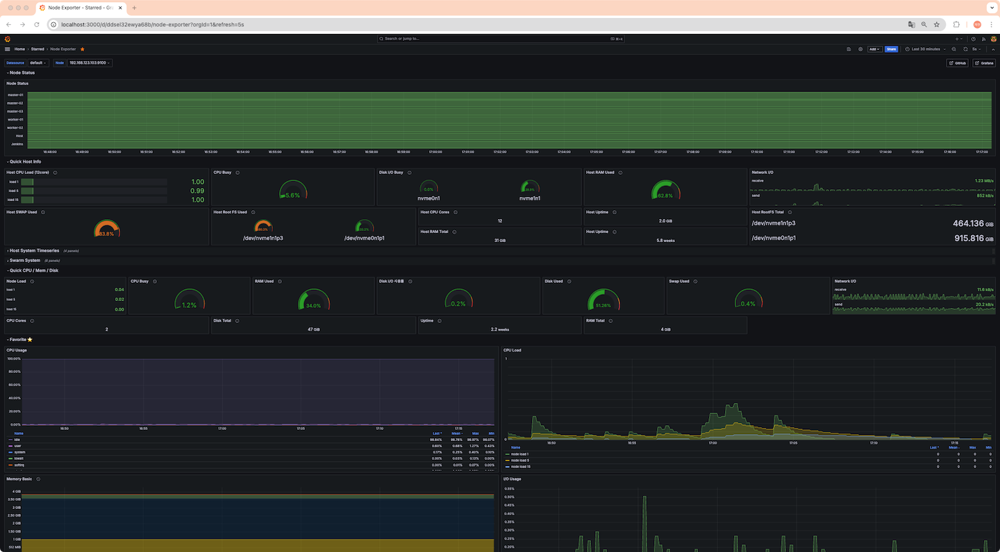
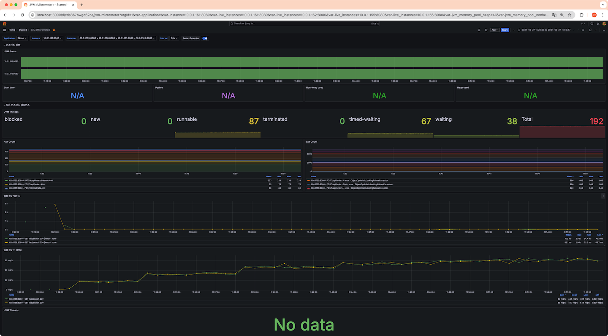
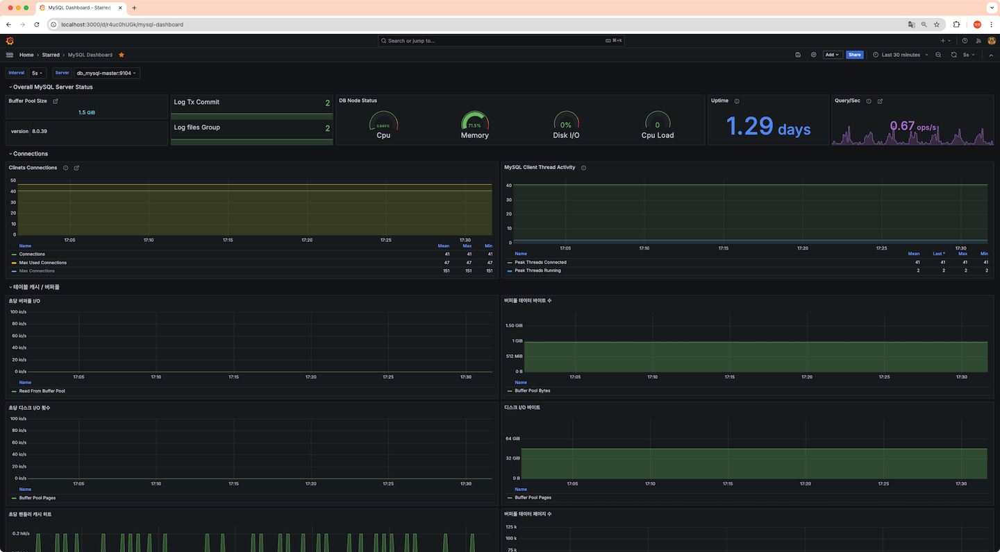
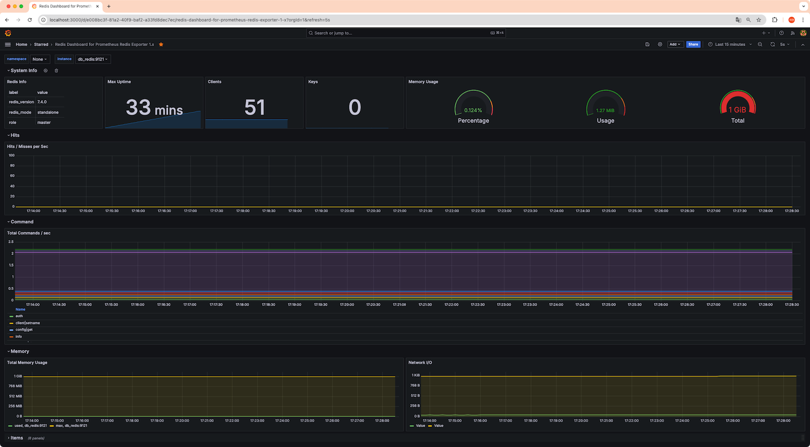
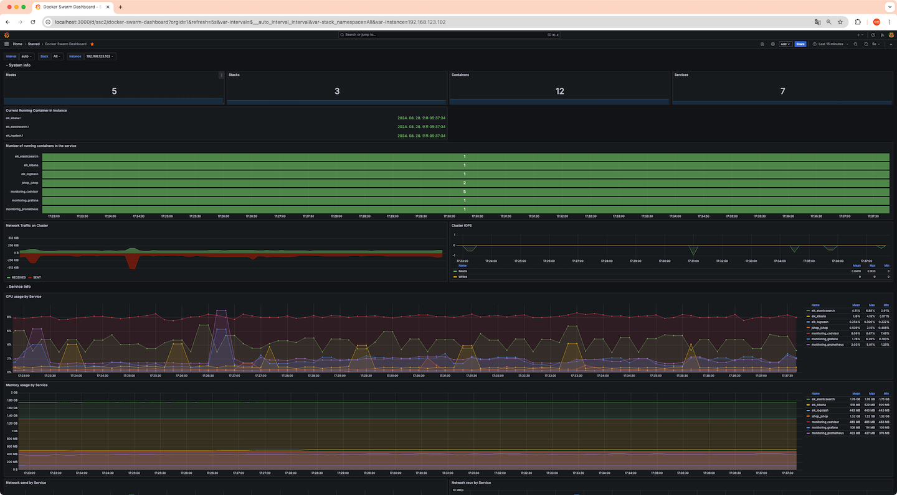

# Grafana 

## Datasource
* Prometheus (Default)

## Dashboard

### 1. [Node Exporter](./node-exporter.json) Dashboard

* node-exporter 1.8.2
* prometheus

노드의 Health, CPU, Memory, Disk, Network 정보를 수집한다.

KVM 으로 VM을 띄워 운영중이므로 호스트 노드의 정보와 각 VM의 정보를 수집함.

추가적으로 jenkins 서버 (Naver Cloud)의 정보도 수집함.

Datasource로 Prometheus를 사용.

### 2. [JVM](./jvm.json) Actuator Dashboard

* jvm actuator (prometheus)
* prometheus

JVM의 Health, Thread, HTTP status, Heap, GC 정보를 수집한다.

Tomcat 의 `http_server_requests_seconds_count`, `http_server_requests_seconds_sum` 으로 요청 응답 시간, 초당 응답 수를 계산해 시각화

HTTP 서버의 응답시간, 초당 응답수, 400예외, 500 예외등을 추적하기 위함.

docker swarm service discovery 로 엔드포인트를 찾기 때문에 컨테이너가 서비스가 업데이트 되어도 불필요한 설정이 없음.

### 3. [Mysql Exporter](./mysql.json) Dashboard

* mysql-exporter 0.15.1
* prometheus

Mysql 인스턴스의 버퍼풀, 커넥션, 메모리, CPU, Disk I/O 정보를 수집한다.

`label_values` 와 `mysql_up` 메트릭으로 시각화할 MySQL 인스턴스를 지정한다.

실시간 디스크 I/O, 버퍼풀 I/O 를 관찰하기 위함.

### 4. [Redis Exporter](./redis.json) Dashboard

* redis-exporter 1.62.0
* prometheus

Redis 인스턴스의 메모리, 실시간 사용량의 정보를 수집한다.

### 5. [Docker Swarm](./docker-swarm.json) Dashboard

* `google/cadvisor` container 0.33.0
* prometheus

Docker Swarm 에서 동작하는 모든 컨테이너들의 정보를 수집한다.

docker swarm service discovery 를 사용해 컨테이너 추가 삭제가 되어도 자동으로 수집.

주로 컨테이너들의 CPU, Memory 사용량, Health 상태, 특정 노드에 어떤 컨테이너가 올라가 있는지를 체크하기 위한 용도로 사용한다.

